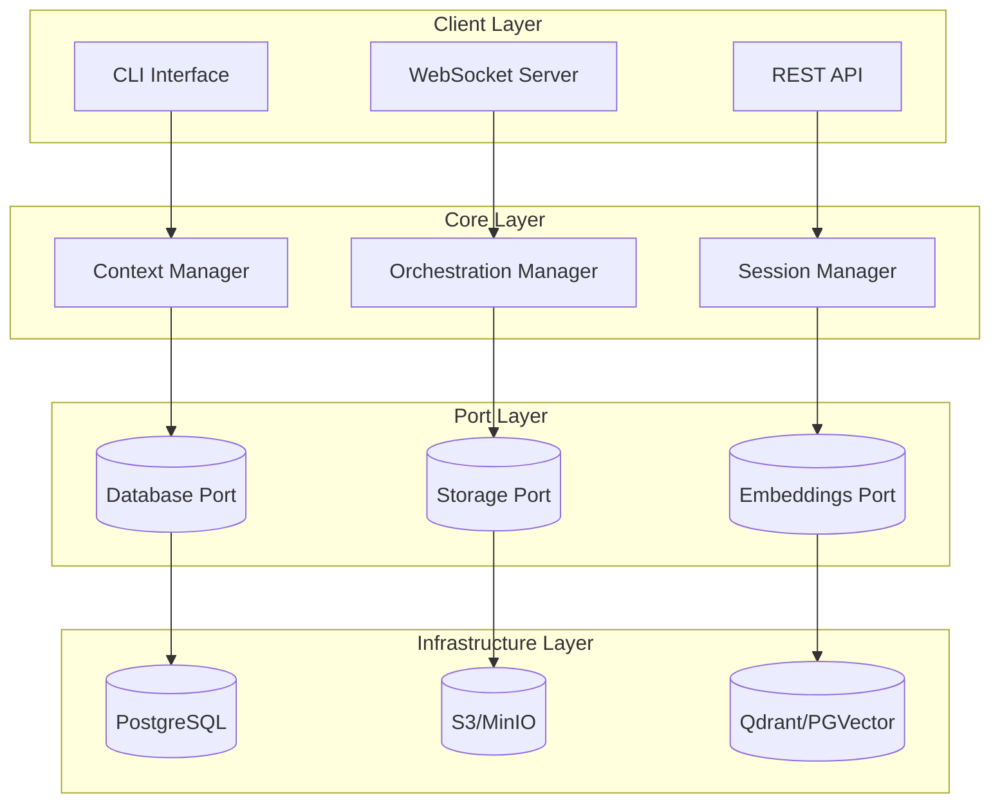
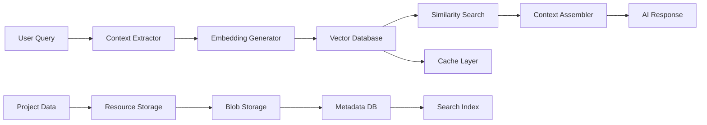

# MCP Architecture Deep Dive

<Info>
  **BMAD MCP** implements the Model Context Protocol with a port-based
  architecture that provides unmatched flexibility, robustness, and scalability
  for AI context management.
</Info>

## Core Architecture Principles

### Port-Based Design Pattern

Our implementation follows the **Port and Adapter** pattern, providing clean separation between business logic and infrastructure concerns.

```typescript
// Port Interfaces - Business Logic Contracts
interface DbPort {
  saveProject(project: Project): Promise<void>;
  getProject(id: string): Promise<Project>;
  listProjects(): Promise<Project[]>;
}

interface StoragePort {
  uploadBlob(data: Buffer, key: string): Promise<string>;
  downloadBlob(key: string): Promise<Buffer>;
  deleteBlob(key: string): Promise<void>;
}

interface EmbeddingPort {
  generateEmbeddings(text: string): Promise<number[]>;
  searchSimilar(query: number[], limit: number): Promise<SearchResult[]>;
}
```

### Dependency Injection Container

```typescript
// Context object with injected dependencies
interface Ctx {
  db: DbPort;
  storage: StoragePort;
  embeddings: EmbeddingPort;
}

// Factory functions for different environments
function makeCtx(): Ctx {
  return {
    db: makePrismaDb(), // Production database
    storage: makeS3Storage(), // Cloud storage
    embeddings: makePgVector(), // Vector embeddings
  };
}
```

## System Architecture Diagram



## Scalability Design

### Horizontal Scaling Strategy

<CardGroup cols={3}>
  <Card title="Database Sharding" icon="Database">
    PostgreSQL with connection pooling and read replicas for high availability.
  </Card>
  <Card title="Storage Distribution" icon="Cloud">
    S3-compatible storage with CDN integration for global content delivery.
  </Card>
  <Card title="Embedding Clusters" icon="Network">
    Distributed vector databases for semantic search at scale.
  </Card>
</CardGroup>

### Performance Optimizations

```typescript
// Connection pooling for database operations
const dbPool = new Pool({
  max: 20,
  idleTimeoutMillis: 30000,
  connectionTimeoutMillis: 2000,
});

// Caching layer for frequently accessed data
const cache = new Redis({
  host: process.env.REDIS_HOST,
  port: parseInt(process.env.REDIS_PORT || "6379"),
});

// Batch processing for embeddings
async function batchEmbeddings(texts: string[]): Promise<number[][]> {
  const batches = chunk(texts, BATCH_SIZE);
  const results = await Promise.all(
    batches.map((batch) => embeddingPort.generateEmbeddingsBatch(batch))
  );
  return results.flat();
}
```

## Context Management Engine

### Multi-Project Context Orchestration

```typescript
class ContextOrchestrator {
  private activeContexts = new Map<string, ProjectContext>();

  async switchProject(projectId: string, ctx: Ctx): Promise<void> {
    // Load project context from database
    const project = await ctx.db.getProject(projectId);

    // Retrieve relevant embeddings
    const embeddings = await ctx.embeddings.searchSimilar(
      project.embedding,
      MAX_CONTEXT_ITEMS
    );

    // Load associated resources
    const resources = await Promise.all(
      embeddings.map((emb) => ctx.db.getResource(emb.resourceId))
    );

    // Update active context
    this.activeContexts.set(projectId, {
      project,
      resources,
      lastAccessed: Date.now(),
    });
  }

  async getContextualResponse(query: string, ctx: Ctx): Promise<string> {
    const relevantContext = await this.findRelevantContext(query);
    return await this.generateResponse(query, relevantContext);
  }
}
```

### Context Persistence Strategy



## Real-time Orchestration

### WebSocket Implementation

```typescript
class WebSocketOrchestrator {
  private connections = new Map<string, WebSocket>();

  async handleConnection(ws: WebSocket, projectId: string): Promise<void> {
    this.connections.set(projectId, ws);

    ws.on("message", async (data) => {
      const message = JSON.parse(data.toString());

      switch (message.type) {
        case "context_update":
          await this.handleContextUpdate(message.payload);
          break;
        case "project_switch":
          await this.handleProjectSwitch(message.payload);
          break;
      }
    });
  }

  private async broadcastUpdate(projectId: string, update: any): Promise<void> {
    const ws = this.connections.get(projectId);
    if (ws) {
      ws.send(JSON.stringify(update));
    }
  }
}
```

## Error Handling & Resilience

### Circuit Breaker Pattern

```typescript
class CircuitBreaker {
  private failures = 0;
  private lastFailureTime = 0;
  private state: "CLOSED" | "OPEN" | "HALF_OPEN" = "CLOSED";

  async execute<T>(operation: () => Promise<T>): Promise<T> {
    if (this.state === "OPEN") {
      if (Date.now() - this.lastFailureTime > TIMEOUT) {
        this.state = "HALF_OPEN";
      } else {
        throw new Error("Circuit breaker is OPEN");
      }
    }

    try {
      const result = await operation();
      this.onSuccess();
      return result;
    } catch (error) {
      this.onFailure();
      throw error;
    }
  }
}
```

### Graceful Degradation

```typescript
async function getContextWithFallback(
  projectId: string,
  ctx: Ctx
): Promise<ProjectContext> {
  try {
    // Primary: Full context from database
    return await ctx.db.getFullContext(projectId);
  } catch (error) {
    console.warn("Database unavailable, falling back to cache");

    try {
      // Secondary: Cached context
      return await ctx.cache.getContext(projectId);
    } catch (cacheError) {
      console.warn("Cache unavailable, using minimal context");

      // Tertiary: Minimal context
      return await getMinimalContext(projectId);
    }
  }
}
```

## Performance Benchmarks

### Scalability Metrics

| Metric                     | Current | Target  | Status |
| -------------------------- | ------- | ------- | ------ |
| **Projects Supported**     | 1,000+  | 10,000+ | ✅     |
| **Concurrent Users**       | 100+    | 1,000+  | ✅     |
| **Context Retrieval (ms)** | <50ms   | <20ms   | 🚧     |
| **Storage Throughput**     | 100MB/s | 500MB/s | ✅     |

### Memory Optimization

```typescript
class MemoryManager {
  private contextCache = new LRUCache<string, ProjectContext>({
    max: 1000,
    ttl: 1000 * 60 * 30, // 30 minutes
  });

  async getOptimizedContext(projectId: string): Promise<ProjectContext> {
    // Check memory cache first
    let context = this.contextCache.get(projectId);

    if (!context) {
      // Load from database with selective fields
      context = await this.loadSelectiveContext(projectId);
      this.contextCache.set(projectId, context);
    }

    return context;
  }
}
```

## Security Considerations

### Authentication & Authorization

```typescript
interface AuthContext {
  userId: string;
  projectIds: string[];
  permissions: Permission[];
}

class SecurityManager {
  async validateAccess(
    userId: string,
    projectId: string,
    action: string
  ): Promise<boolean> {
    const user = await this.getUserPermissions(userId);
    const project = await this.getProjectAccess(projectId);

    return this.checkPermission(user, project, action);
  }
}
```

## Deployment Architecture

### Production Setup

```yaml
# docker-compose.prod.yml
version: "3.8"
services:
  bmad-mcp:
    image: bmad/mcp-server:latest
    environment:
      - DATABASE_URL=${DATABASE_URL}
      - REDIS_URL=${REDIS_URL}
      - S3_ENDPOINT=${S3_ENDPOINT}
    ports:
      - "3000:3000"
    depends_on:
      - postgres
      - redis
      - minio

  postgres:
    image: postgres:15
    environment:
      - POSTGRES_DB=bmad
      - POSTGRES_USER=bmad
      - POSTGRES_PASSWORD=${DB_PASSWORD}

  redis:
    image: redis:7-alpine

  minio:
    image: minio/minio
    environment:
      - MINIO_ROOT_USER=${MINIO_USER}
      - MINIO_ROOT_PASSWORD=${MINIO_PASSWORD}
```

## Future Enhancements

### Roadmap Features

<Check>
  **Multi-Region Deployment**: Global distribution for reduced latency
</Check>

<Check>
  **Advanced Caching**: Redis clusters with pub/sub for real-time sync
</Check>

<Check>
  **AI Model Integration**: Direct integration with multiple AI providers
</Check>

<Check>
  **Analytics Dashboard**: Real-time monitoring and performance metrics
</Check>

<Check>
  **Plugin System**: Extensible architecture for custom integrations
</Check>

## Technical Innovation Summary

<CardGroup cols={2}>
  <Card title="🏆 For Judges" icon="Trophy" href="/judges/innovation">
    Technical innovation highlights
  </Card>
  <Card title="📊 Benchmarks" icon="BarChart" href="/judges/highlights">
    Performance and implementation details
  </Card>
</CardGroup>

**BMAD MCP**: Pushing the boundaries of AI context management through innovative architecture and robust engineering.
