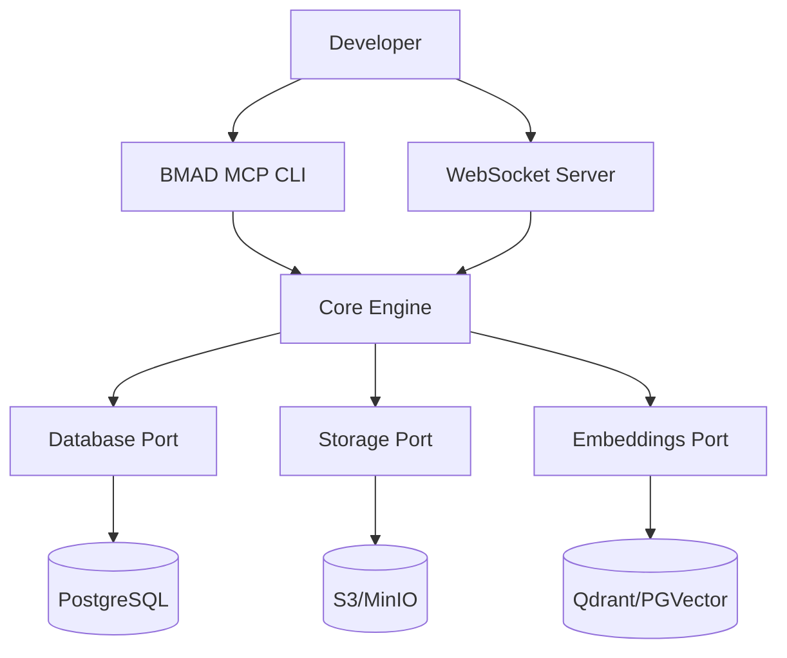

# Scale AI Context Management Across Any Number of Projects

<Info>
  **BMAD MCP** transforms how developers orchestrate AI context across multiple
  projects, providing the flexibility and robustness needed for modern
  development workflows.
</Info>

## The Context Management Crisis

Traditional AI tools struggle with context management across multiple projects:

- **Fragmented Context**: Each project maintains its own isolated context
- **Inconsistent Outputs**: AI responses vary based on limited project scope
- **Manual Orchestration**: Developers manually switch between project contexts
- **Scalability Limits**: Fixed context windows restrict project complexity

## The BMAD MCP Solution

<CardGroup cols={3}>
  <Card title="Infinite Scalability" icon="Zap">
    Scale context management across any number of projects without performance
    degradation.
  </Card>
  <Card title="MCP Architecture" icon="Network">
    Port-based design enables flexible, robust orchestration of AI tools and
    context.
  </Card>
  <Card title="Unified Experience" icon="Target">
    Single interface for managing context across all your development projects.
  </Card>
</CardGroup>

## Why MCP Architecture Matters

Our implementation of the **Model Context Protocol** provides:

- **Port-Based Design**: Clean separation of concerns with dependency injection
- **Flexible Orchestration**: Connect any AI tool or context source seamlessly
- **Robust Error Handling**: Graceful degradation and recovery mechanisms
- **Performance Optimized**: Efficient context switching and memory management

## Quick Start in 5 Minutes

Get started with BMAD MCP in under 5 minutes:

```bash
# Clone the repository
git clone https://github.com/ujjwalgoyal19/bmad-mcp-server.git
cd bmad-mcp-server

# Install dependencies
bun install

# Start the development environment
bun run compose:up

# Run the CLI
bun run dev:cli
```

## Key Features

<Check>
  **Multi-Project Context Management**: Seamlessly switch between project
  contexts
</Check>

<Check>
  **Real-time Orchestration**: WebSocket-based real-time context updates
</Check>

<Check>
  **Persistent Storage**: PostgreSQL + Vector embeddings for semantic search
</Check>

<Check>
  **Cloud-Native Storage**: S3/MinIO integration for scalable blob storage
</Check>

<Check>
  **Developer-First CLI**: Intuitive command-line interface for all operations
</Check>

## Architecture Overview



## Built for Hackathons & Production

BMAD MCP is designed with both hackathon agility and production robustness in mind:

- **Rapid Prototyping**: Get started in minutes with sensible defaults
- **Production Ready**: Scalable architecture for real-world deployments
- **Developer Experience**: Intuitive APIs and comprehensive documentation
- **Performance Focused**: Optimized for low-latency context operations

## Next Steps

<CardGroup cols={2}>
  <Card title="🚀 Quick Start" icon="Rocket" href="/quick-start">
    Get up and running in 5 minutes
  </Card>
  <Card title="🏗️ Architecture" icon="Building" href="/architecture">
    Deep dive into MCP architecture
  </Card>
</CardGroup>

Ready to revolutionize your AI context management? Let's get started!
