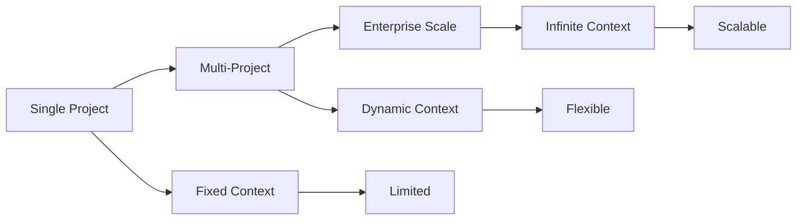

# Why BMAD MCP?

<Warning>
  **The Context Management Crisis**: Modern AI tools are powerful but struggle
  with managing context across multiple projects, leading to inconsistent
  outputs and poor developer experience.
</Warning>

## The Problem: Context Fragmentation

### Traditional AI Tool Limitations

| Challenge                 | Impact                                      | Current Solutions        |
| ------------------------- | ------------------------------------------- | ------------------------ |
| **Single Project Focus**  | AI responses limited to one project context | Manual context switching |
| **Fixed Context Windows** | Token limits restrict project complexity    | Truncated conversations  |
| **Isolated Sessions**     | No cross-project learning                   | Repeated explanations    |
| **Manual Orchestration**  | Developer overhead                          | Error-prone workflows    |

### Real-World Developer Pain Points

<Tabs>
  <Tab title="Multi-Project Development">
    ```typescript
    // Current: Manual context management
    const projectA = await ai.generate("Build API for project A");
    const projectB = await ai.generate("Build API for project B");

    // No shared context, inconsistent outputs
    ```

  </Tab>

<Tab title="Context Switching">
  ```bash # Current workflow cd project-a && ai chat "implement feature X" cd
  project-b && ai chat "implement feature Y" # Context lost between switches ```
</Tab>

  <Tab title="Large Codebases">
    ```typescript
    // Current limitation: Fixed context windows
    const context = getProjectContext(); // Limited to ~4K tokens
    const response = await ai.generate(prompt, context);
    ```
  </Tab>
</Tabs>

## The Solution: MCP Architecture

### What Makes MCP Revolutionary

<CardGroup cols={2}>
  <Card title="Port-Based Design" icon="Network">
    Clean separation of concerns with dependency injection patterns for maximum
    flexibility.
  </Card>
  <Card title="Infinite Scalability" icon="Zap">
    Scale context management across any number of projects without performance
    degradation.
  </Card>
  <Card title="Unified Orchestration" icon="Target">
    Single interface for managing all AI context operations across your
    development workflow.
  </Card>
  <Card title="Robust Error Handling" icon="Shield">
    Graceful degradation and recovery mechanisms ensure reliability at scale.
  </Card>
</CardGroup>

### BMAD MCP Advantages

<Check>
  **Context Persistence**: PostgreSQL-backed storage maintains context across
  sessions
</Check>

<Check>
  **Vector Embeddings**: Semantic search capabilities for intelligent context
  retrieval
</Check>

<Check>
  **Real-time Updates**: WebSocket connections for live context synchronization
</Check>

<Check>**Cloud-Native**: S3/MinIO integration for scalable blob storage</Check>

<Check>
  **Developer-First**: Intuitive CLI and APIs designed for developer workflows
</Check>

## Technical Innovation: MCP Implementation

### Port-Based Architecture

```typescript
// BMAD MCP Port Interface
interface MCPPort {
  connect(): Promise<void>;
  disconnect(): Promise<void>;
  execute(operation: MCPOperation): Promise<MCPResult>;
}

// Flexible composition
const contextManager = new MCPContextManager({
  database: makeDatabasePort(),
  storage: makeStoragePort(),
  embeddings: makeEmbeddingsPort(),
});
```

### Scalability Design



## Real-World Impact

### Before BMAD MCP

- Manual context management across projects
- Inconsistent AI responses
- Limited scalability
- Poor developer experience

### After BMAD MCP

- Unified context orchestration
- Consistent, high-quality AI outputs
- Infinite scalability
- Superior developer experience

## Competitive Advantages

| Feature                   | BMAD MCP       | Traditional Tools | Enterprise Solutions |
| ------------------------- | -------------- | ----------------- | -------------------- |
| **Multi-Project Support** | ✅ Native      | ❌ Limited        | ✅ Complex           |
| **Scalability**           | ✅ Infinite    | ❌ Fixed          | ✅ Expensive         |
| **Developer Experience**  | ✅ Optimized   | ⚠️ Basic          | ⚠️ Enterprise        |
| **Cost Efficiency**       | ✅ Open Source | ✅ Variable       | ❌ High              |
| **Flexibility**           | ✅ MCP Ports   | ❌ Rigid          | ⚠️ Limited           |

## Built for the Future

BMAD MCP is designed with tomorrow's challenges in mind:

- **AI Model Evolution**: Adaptable to new AI models and capabilities
- **Enterprise Integration**: Ready for production deployment
- **Developer Ecosystem**: Extensible for custom integrations
- **Performance Optimization**: Built for low-latency operations

## Ready to Transform Your Workflow?

<CardGroup cols={2}>
  <Card title="🚀 Try It Now" icon="Rocket" href="/quick-start">
    Experience the difference in 5 minutes
  </Card>
  <Card title="📖 Learn More" icon="Book" href="/architecture">
    Deep dive into the architecture
  </Card>
</CardGroup>

**BMAD MCP**: From Context Chaos to Orchestrated Intelligence.
