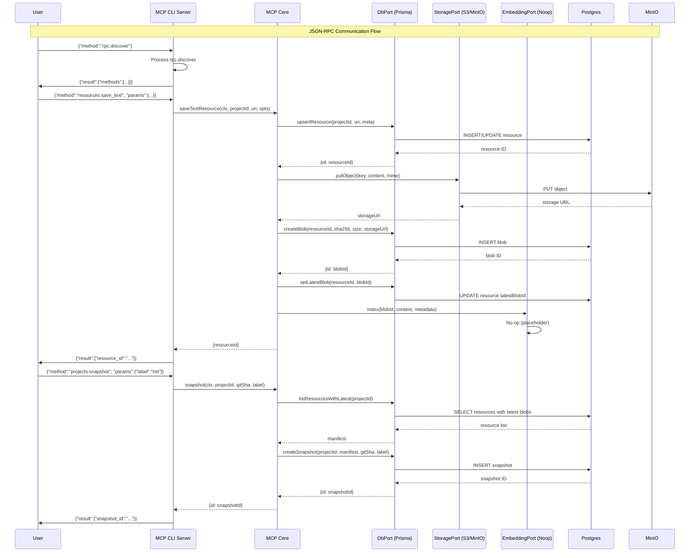

```mermaid
sequenceDiagram
    participant User
    participant CLI as MCP CLI Server
    participant Core as MCP Core
    participant DB as DbPort (Prisma)
    participant Storage as StoragePort (S3/MinIO)
    participant Embed as EmbeddingPort (Noop)
    participant Postgres
    participant MinIO

    Note over User,MinIO: JSON-RPC Communication Flow

    User->>CLI: {"method":"rpc.discover"}
    CLI->>CLI: Process rpc.discover
    CLI->>User: {"result":{"methods":[...]}}
    
    User->>CLI: {"method":"resources.save_text", "params":{...}}
    CLI->>Core: saveTextResource(ctx, projectId, uri, opts)
    Core->>DB: upsertResource(projectId, uri, meta)
    DB->>Postgres: INSERT/UPDATE resource
    Postgres-->>DB: resource ID
    DB-->>Core: {id: resourceId}
    
    Core->>Storage: putObject(key, content, mime)
    Storage->>MinIO: PUT object
    MinIO-->>Storage: storage URL
    Storage-->>Core: storageUrl
    
    Core->>DB: createBlob(resourceId, sha256, size, storageUrl)
    DB->>Postgres: INSERT blob
    Postgres-->>DB: blob ID
    DB-->>Core: {id: blobId}
    
    Core->>DB: setLatestBlob(resourceId, blobId)
    DB->>Postgres: UPDATE resource latestBlobId
    
    Core->>Embed: index(blobId, content, metadata)
    Embed->>Embed: No-op (placeholder)
    
    Core-->>CLI: {resourceId}
    CLI->>User: {"result":{"resource_id":"..."}}
    
    User->>CLI: {"method":"projects.snapshot", "params":{"label":"init"}}
    CLI->>Core: snapshot(ctx, projectId, gitSha, label)
    Core->>DB: listResourcesWithLatest(projectId)
    DB->>Postgres: SELECT resources with latest blobs
    Postgres-->>DB: resource list
    DB-->>Core: manifest
    
    Core->>DB: createSnapshot(projectId, manifest, gitSha, label)
    DB->>Postgres: INSERT snapshot
    Postgres-->>DB: snapshot ID
    DB-->>Core: {id: snapshotId}
    
    Core-->>CLI: {id: snapshotId}
    CLI->>User: {"result":{"snapshot_id":"..."}}
```
